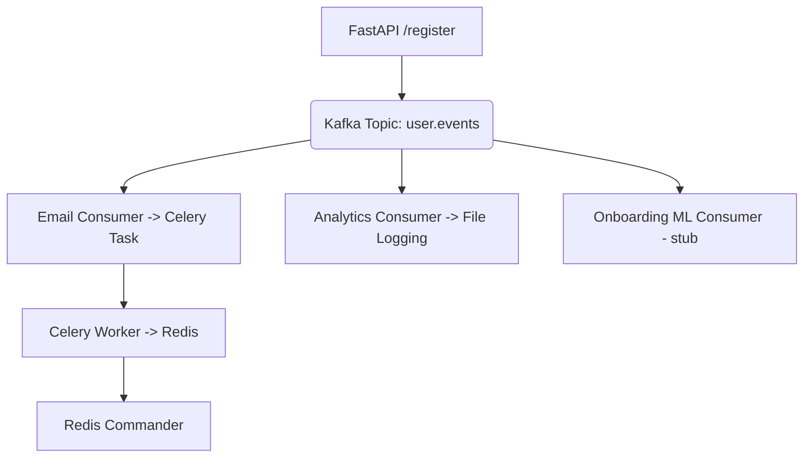

# Celery + Kafka + FastAPI + Redis + Redis Commander – Event-Driven Project

This project demonstrates an end-to-end **event-driven microservices architecture** using:

- **FastAPI**: API gateway that publishes events
- **Apache Kafka**: Event streaming platform
- **Celery**: Task queue for background job execution
- **Redis**: Broker & result backend for Celery
- **Redis Commander**: Visual dashboard to inspect Redis
- **Docker Compose**: Container orchestration for Redis/Kafka ecosystem

---

## Architecture Overview



---

## Functional Flow

1. User hits `POST /register`
2. FastAPI publishes a `user_registered` event to Kafka
3. Kafka has **3 consumers**:
    - ✅ **Email**: Triggers a Celery task to send a welcome email
    - 📊 **Analytics**: Logs event to `analytics_log.txt`
    - 🧠 **ML Stub**: (Pluggable third consumer)
4. Celery stores task results in Redis
5. Task status is viewable:
    - via `GET /task-status/{task_id}`
    - or visually in Redis Commander

---

## 🛠️ Project Structure

```
celery-kafka-app/
├── app/
│   ├── main.py                # FastAPI endpoints
│   ├── producer.py            # Publishes Kafka events
│   ├── consumer_email.py      # Kafka → Celery email task
│   ├── consumer_analytics.py  # Kafka → Log to file
│   ├── consumer_ml.py         # Kafka → ML stub (optional)
│   ├── tasks.py               # Celery tasks
│   └── celery_config.py       # Celery instance
├── docker-compose.yml
├── requirements.txt
├── analytics_log.txt          # Event logs (auto-created)
└── README.md
```

---

## 🐳 Docker Services

```yaml
# docker-compose.yml

services:
  redis:
    image: redis:7
    ports: [ "6379:6379" ]

  redis-commander:
    image: rediscommander/redis-commander
    ports: [ "8081:8081" ]
    environment:
      - REDIS_HOSTS=local:redis:6379

  zookeeper:
    image: confluentinc/cp-zookeeper:7.3.2
    environment:
      ZOOKEEPER_CLIENT_PORT: 2181

  kafka:
    image: confluentinc/cp-kafka:7.3.2
    depends_on: [ zookeeper ]
    ports: [ "9092:9092" ]
    environment:
      KAFKA_ZOOKEEPER_CONNECT: zookeeper:2181
      KAFKA_ADVERTISED_LISTENERS: PLAINTEXT://localhost:9092
      KAFKA_OFFSETS_TOPIC_REPLICATION_FACTOR: 1
```

---

## Python Setup

### 1. Install dependencies
```bash
pip install fastapi uvicorn celery redis kafka-python
```

Or from requirements.txt:

```bash
pip install -r requirements.txt
```

---

## How to Run

### 1. Start Docker services
```bash
docker-compose up -d
```

### 2. Run FastAPI
```bash
uvicorn app.main:app --reload
```

### 3. Start Celery Worker
```bash
celery -A app.tasks worker --loglevel=info --pool=solo
```

### 4. Start Kafka Consumers

```bash
python -m app.consumer_email
python -m app.consumer_analytics
```

---

## API Usage

### Register a User
```http
POST /register
Content-Type: application/json

{
  "user_id": 101,
  "name": "Venky",
  "email": "venky@abc.com"
}
```

### Check Task Status
```http
GET /task-status/{task_id}
```

---

## 🔍 Monitor Redis Tasks

Visit: [http://localhost:8081](http://localhost:8081)  
View task metadata (e.g. `celery-task-meta-xyz...`) and results.

---

## 📝 To Do

- Add Flower dashboard (optional)
- Expand ML Consumer
- Add DB logging for analytics

---

## Status

✔️ FastAPI → Kafka → Consumers  
✔️ Celery async tasks with Redis  
✔️ Task tracking via API  
✔️ Visual inspection with Redis Commander  

---

> Built to demonstrate modern async/event-driven microservices with FastAPI, Celery, Redis, and Kafka.
